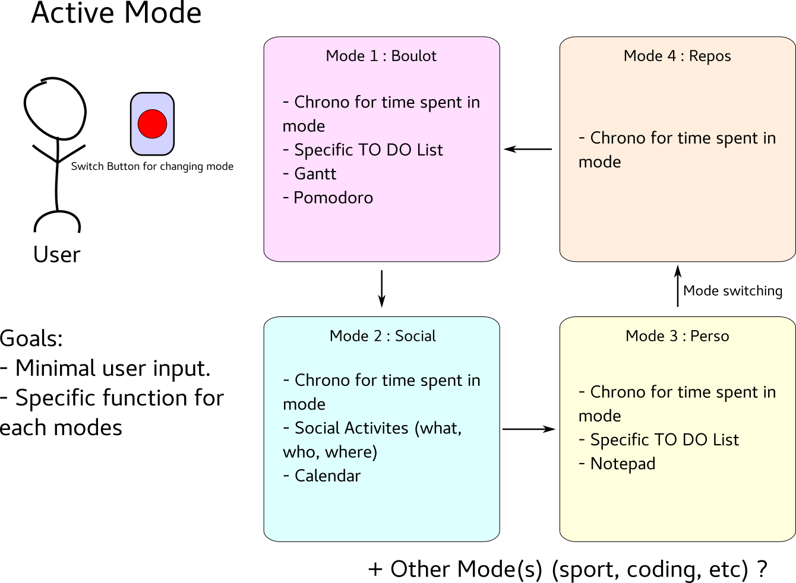
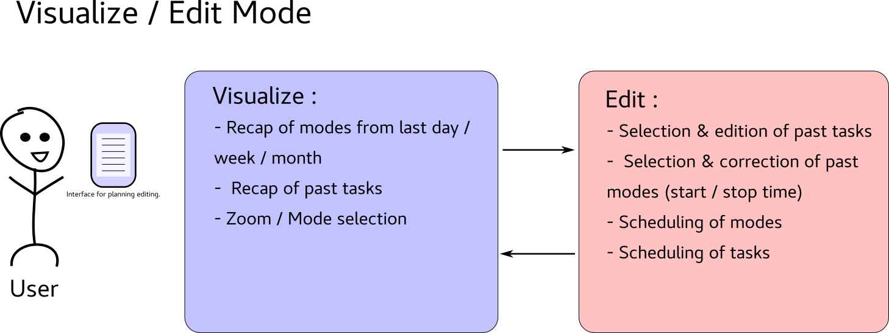

# Planisphere
A small multiplatform system that aims to provide time-management and organisational tools and metrics such as time spent at home / at office / in transports, gantt scheduling, and event management. Its key features are a distributed synchronisation across devices and smart scheduling for future events.

## Installation
The app will be a web-app at first, developed using the JHipster framework / app generator.
More about JHipster : https://www.jhipster.tech/presentation/#/
How to install JHipster : https://www.jhipster.tech/installation/

## Functional Description
The following image describe how Planisphere (is going to) work(s) :

